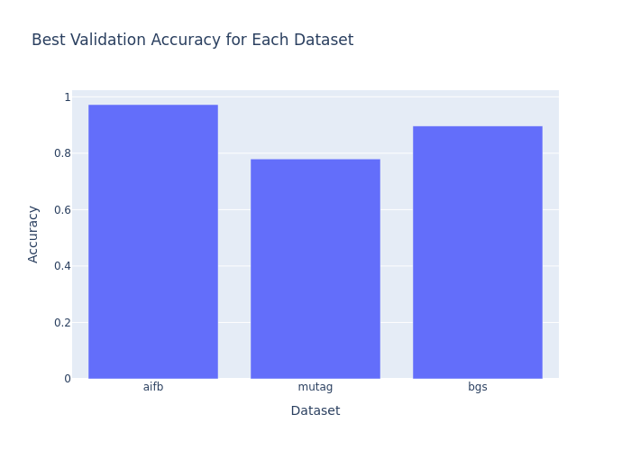

# RGCN for Entity Classification

This project implements a Relational Graph Convolutional Network (RGCN) for entity classification using the DGL library. The model is trained and evaluated on various datasets, including AIFB, MUTAG, BGS, and AM.

## Project Structure

- `trainUtility.py`: Contains utility functions for loading datasets and preparing graphs for training.
- `train.py`: Main script for training and evaluating the RGCN model.
- `RgcnModel.py`: Defines the RGCN model architecture.
- `LoadDataset.py`: Contains functions to load different datasets.
- `Layer.py`: Implements the RGCN layer.
- `requirements.txt`: Lists the required Python packages.

## Installation

To install the required packages, run:

```bash
pip install -r requirements.txt
```

## Usage

To train and evaluate the model on a specific dataset, run:

```bash
python train.py --dataset <dataset_name>
```

Replace `<dataset_name>` with one of the following: `aifb`, `mutag`, `bgs`, `am`.

To plot the best validation accuracies for all datasets, run:

```bash
python train.py --plot --save_plot <file_name>
```

Replace `<file_name>` with the desired file name for the plot image.

## Example Plot

Below is an example plot of the best validation accuracies for all datasets:



## License

This project is licensed under the MIT License.